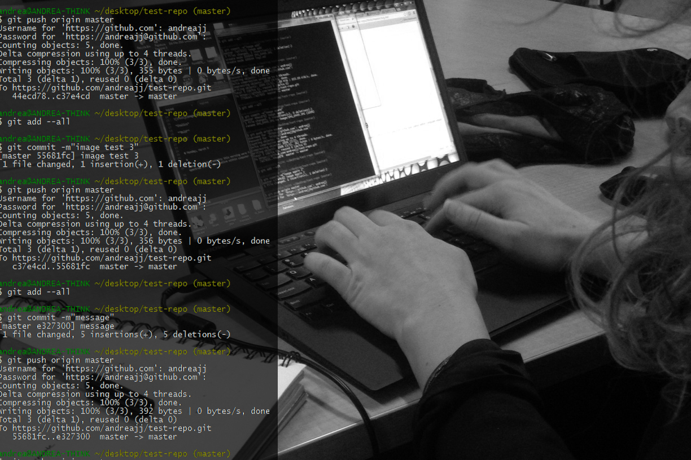
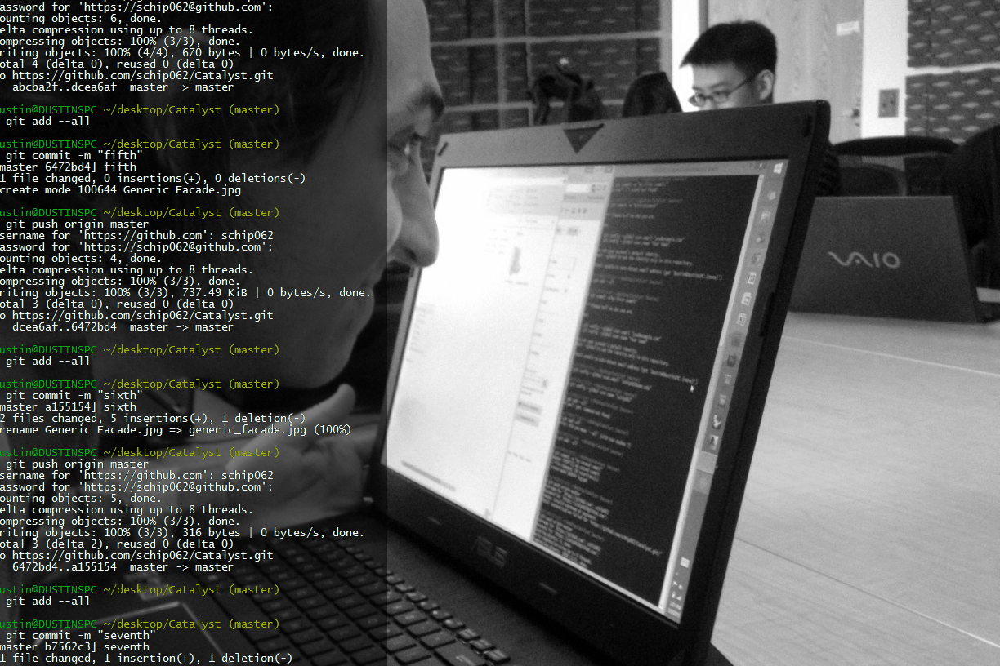
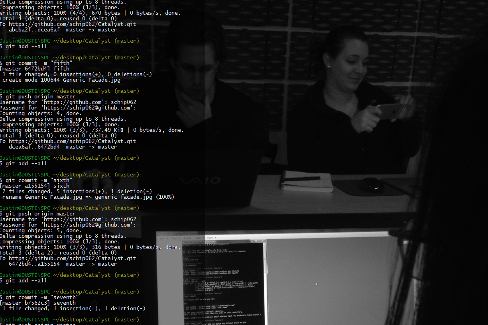

Monday March 9, 2015.

#1. Introduction to Machine Vision
##Today our Instructor did Battle with A Robot

#2. Blue Sky Dreaming

###Perceptual Contour
* document light and shadow on the building facade as a way to understand the mass. Allow the machine way of seeing to accentuate the missreading of the building. Then Translate these mistakes into a digital model.

###The Implications of the Door
* document just doors arround the Twin Cites as a way to understand consistancy and differnces between regions. The door becomes an indicator for many other unrepresented conditions.

###Building Contour Reveals
* document building outline is used to understand the code that shade the building. 

###Croud Perception of Facades
* pull images from databases of public photos to create a digital model of how the public percieves a building facade. Here there would be large biases for the building files.

#3. Lunch Lecture

#4. Afternoon Notes

pwd - print working drive
cd - change directory
ls - list selected

####Markdown (.md)

#Title
##Subtitle
###Subsubtitle
####Subsubsubtitle

List
* one
* two
* three

[LINK](httpp://umn.edu)

*Italics*

**Bold**

`code`

Database - Markdown Cheet Sheet

#Git

fetch
pull
push

Sams-MacBook-Pro-4:Catalyst-2015 samdaley$ git remote -v 					changes happen
Sams-MacBook-Pro-4:Catalyst-2015 samdaley$ git add --all					set the stage
Sams-MacBook-Pro-4:Catalyst-2015 samdaley$ git commit -m "Updated Notes"	discription (metadata)
Sams-MacBook-Pro-4:Catalyst-2015 samdaley$ git push origin master			update to github

Sams-MacBook-Pro-4:Catalyst-2015 samdaley$ git push origin master			update to github

5. For tomorrow
	Question - What Site?
	Playing in photo scan!
		The mall - scale

6. Photogramity
	Turn table
	a. arround
	b. top
	c. occlusions
	d. avoid patterns
	e. avoid reflective surfaces
	f. avoid subjects in forground
	g. maintain distance
	h. maintain interior
	i. less than 1500 pixels (small setting)

7. Stratagies
	a. Whole builing
	b. Elements of buildings

